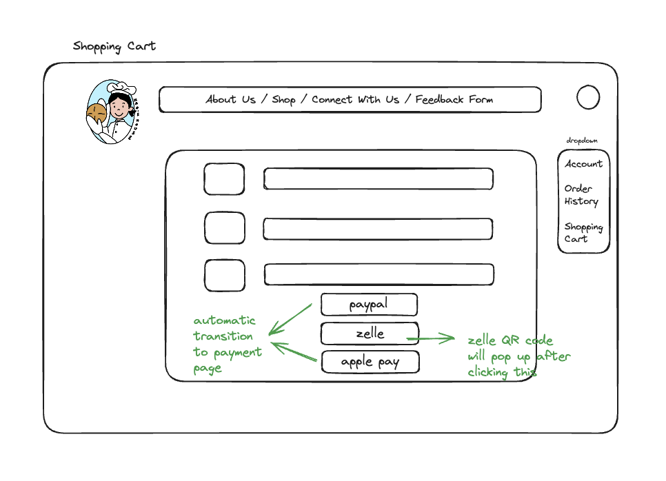

# Hao's House

## Overview
Welcome to the online storefront of my home bakery - Hao's House!

An upgrade from my original selling venue, here, you get to create your own account as one of my valued customers. Once you're logged in, you can conveniently add and remove items to/from shopping cart, place orders, report issues regarding your order, as well as and provide general feedbacks. Moreover, you get to fill in your food preferences/allergies which I, the creator behind this website as well as the baked goods you love, actively keep track of. 

## Data Model

NOTE: the functionalities related to Orders and Issues models have not been implemented for the purpose of the final project

1. Customer Accounts
* Username: User's chosen username.
* Email
* FullName
* Address
  *  street
  *  city
  *  state
  *  zipCode
* Preferences
  * sweetness
  * flavor
  * product
  * allergies
* OrderHistory: reference to orders
* IssuesReported: reference to issues
* FeedbacksGiven: reference to feedbacks

2. Shopping Cart
* UserID: reference to user
* Items: embedded document
* ProductID: reference to product
* Quantity: number of items

3. Products
* ProductID
* Name
* Description
* Price
* Category
* Ingredients
* In Stock

4. Orders
* OrderID
* UserID
* Items: list of items ordered
  * productID: reference to the product
  * quantity
* TotalPrice
* OrderDate
* Status: current status of the order (e.g., processing, out for delivery, delivered)

5. Issues
* IssueID
* UserID: reference to the user who reported the issue.
* OrderID: reference to the related order.
* Description
* Status: current status of the issue (e.g., open, resolved).
* DateReported

6. Feedbacks
* FeedbackID
* UserID: reference to the user who provided feedback
* Content
* Date

7. Owner Accounts:
* Username: User's chosen username.
* Email

An Example Customer:

```javascript
{
    _id: ObjectId('6622b6a666058adbc503777f'),
    userType: 'customer',
    username: 'bzzzzzz',
    email: 'hw2606@nyu.edu',
    fullName: 'Lisa Wang',
    address: {
      street: '287 Avenue C, Apt 5g',
      city: 'New York',
      state: 'New York',
      zipCode: '10009'
    },
    preferences: {
      sweetness: 'light',
      flavors: 'strawberry',
      types: [ 'cake' ],
      allergies: [ 'gluten' ]
    },
    orderHistory: [],
    issuesReported: [],
    feedbacksGiven: [],
    salt: 'b647e5a8d1f7da31c93e20f87c5447f25a5bdf6a342331241c4e2ca8bdc64195',
    hash: '273f5b2f359ffb7e87c2c6a4bbc061f6c6ddf0b284b3b22e210d196775a56cee1f01af8462953098d2947516cc09866d7fb9157649ea28109b409ef12be2cb9f33c1578b529a902da6e042ec7c7b045be11670fbd387177e4071e10483938df9194999aa052ad260fb960231be10d3580b39aa24c3e71d8d7a80102a73863265550e28e9ee8edacfa1349e2c1e350ffd07c78d302765fa785d441d948bc0246d7cbcbb901add78e28ad999e5f5ce85adbdc3830f2bc2611b603112e0067d8cb17e3461d6cfc4a79c2575d7e5596e0c4253eb9e394153ce07107ee0dc9a0f278be8aab7a0fd8cf938b4b362687df6c9a625b47109c46519f6fc5757c87c364f3891738aaf499c6860cdd78e5e6acac2152a45412c3c694ad587e0890df19797d2c456d6bba59e17bead6b67ff436b024556666212a4cabd141a5ccaf6eeaa0c8f7d74d7bee5c7688ac5ed5173b651ea1a0ebac5c923c377a5ada36ce52310346ce8a3822fb305c4d85dabeea3ce36b2b6a3f54ddaec96370b132820fa5957537c354b6b5cb82b79c2f6e5a6516d2cc76f8adb5b06530b0de9d71fc73c8b0c3dcdce19d10c68b057a3a70f111673325540b11e63c039cc57dbb8bb37ab657e52026580eaf716d0e92af8c2150209bc01bfa414aa98f0feaf109d38c20cb31e589f8bed6fc953e4ec1c1c5dab95c4f124f984ed07bcb0e3238c79fb17dd3a5b18a6',
    __v: 0
}
```

An Example Shopping Cart: 

```javascript
{
    _id: ObjectId('661c42086e50f7bca918738d'),
    userId: ObjectId('661058b8b2ac3b814a66c460'),
    items: [],
    createdAt: ISODate('2024-04-14T20:52:24.708Z'),
    updatedAt: ISODate('2024-04-14T20:52:30.883Z'),
    __v: 1
}
```

An Example Product:

```javascript
{
    _id: ObjectId('66158eb74f9c54a275cdd25f'),
    name: 'sourdough',
    description: 'homemade sourdough',
    price: 10,
    category: 'bread',
    ingredients: [
      'starter',
      ' whole wheat flour',
      ' high gluten flour',
      ' salt',
      ' water'
    ],
    inStock: true,
    images: [ '/uploads/images-1712688823313.jpg' ],
    slug_history: [ 'sourdough' ],
    slug: 'sourdough',
    __v: 0
}
```

An Example Order:

``` javascript
{
  "_id": ObjectId("62b111111111111111111111"),
  "userID": ObjectId("62a000000000000000000001"),
  "items": [
    {
      "productID": ObjectId("630666666666666666666666"),
      "quantity": 2
    }
  ],
  "totalPrice": 13.97,
  "orderDate": ISODate("2023-03-10T08:00:00Z"),
  "status": "delivered"
}
```

An Example Issue:

``` javascript
{
  "_id": ObjectId("62c222222222222222222222"),
  "userID": ObjectId("62a000000000000000000001"),
  "orderID": ObjectId("62b111111111111111111111"),
  "description": "The sourdough bread was not fully baked.",
  "status": "resolved",
  "dateReported": ISODate("2023-03-15T10:00:00Z")
}
```


An Example Feedback:

``` javascript
{
  "_id": ObjectId("62d333333333333333333333"),
  "userID": ObjectId("62a000000000000000000001"),
    "content": "More cakes pls!",
  "date": ISODate("2023-03-20T12:00:00Z")
}
```

An Example Owner:

```javascript
{
 
  {
    _id: ObjectId('6614723ce20367df311e25a7'),
    userType: 'owner',
    username: 'franklin_cheng',
    email: 'haos.bread.house@gmail.com',
    salt: '8a6aff2db41bc5b0a80d8bb42a7982e40c90f57e6f531dbd16080a64fbe4c8a6',
    hash: '1f3f08abbd736a2e0ee9b0b1a4663431f14291f6bfb3685139a9e51c8f49a640af3cee2872e6a81b955b563155ab494a7d7d3ed97cb87e14c5a718197f1a14c72a4fd744fc9430aeb31297d0a7455df3dad5c1777fff8cb4588bb99b36c1490552e7fc08ad6d2f0a1b63966e84de313ded9716d310a08e54ef4d57096bf544ba9e57a580f3cf22917dea04f73aa830f5633ed6dd76c5176e7554e069c47657186a1addaacb15aa92031cc282ed1804b5d0d2c6018e6753f736e704cf8b79689d3f8109358b041923b216ad5eb9fd2f9fc85167e19a5a42a8e46dc4f1031665a9d2fab856604ea2ad8a0103474b0c29740c5609432f3692dd106cad4a419cb9749f275dd8d2b820a49442c8e81d41520197b18c7e28001bdec24db9232d3fa691d5e07510be032faf144bcb8e88a4f68b9ce8d95c51876787fc1c57d14e70d00bea6c9fc675aaec4cfd7383c7271ad7ae7a64bad75f3cf3d209c9eae8dcf17875ff71c2651192b77972216126d9024a350eaf0beb178048635a0c3811571875c2165931090825dfd4686bf807e3e45cee08cfee3a9262dc7475b202b3d326162a518e2d5d0498d946aa950a0f38f934b84f8246b807e0ecca4e1f25d9c254c2a58136f1d73e9628c2e87591a1e1e926fcfc12b357e9db3ba7a69a84cb11bb93d1b5704c6c58c5d1e6acb9cd91678e667eb611b984d2dbab861f447bd1b5cd5a84',
    __v: 0
  }
```

## [Link to Commented First Draft Schema](db.mjs) 

[db.mjs](db.mjs)


## Wireframes





## Site map


## User Stories or Use Cases

* As a visitor, I can browse the bakery products that the owner has uploaded
* As a visitor, I can view detailed information about a product, including ingredients and prices, so I can make informed purchasing decisions.
* As a visitor, I can create an account so I can place orders.
* As a visitor, I can leave general feedback.

* As a registered customer, I can log into my account to access my personal dashboard.
* As a registered customer, I can update my personal information, including my delivery address, so my orders are delivered to the correct location.
* As a registered customer, I can add items to my cart and check out so I can receive the products I want.
* As a registered customer, I can leave general feedback.
* As a registered customer, (TODO: I can report any issues with my orders so I can get assistance and resolve any problems.)

* As an owner, I can to add, update, and remove product listings so the website reflects our current offerings.

Some uses that I have not implemented (not required as a part of the final project, will come back in the future)
* As a registered customer, I can view my previous orders so I can reorder items or track my spending.
* As a registered customer, I can track the status of my current orders so I know when to expect delivery.
* As an owner, I can edit the products/images featured on the main page
* As an owner, I can view and manage incoming orders by changing their status.
* As an owner, I can respond to customer inquiries and issues so I can maintain high customer satisfaction.


## Research Topics

* [4 points] Implementing Role Based Access Control (RBAC)
* [3 points] Use passport for user authentication
* [2 points] Use Semantic UI
* [1 point] Use multer to support image upload for owners


## [Link to Initial Main Project File](app.mjs) 

[app.mjs](app.mjs)

## Annotations / References Used

(in addition to links in comment)
1. https://medium.com/@techsuneel99/implementing-role-based-access-control-rbac-in-node-js-871591b80a83#:~:text=Role%2DBased%20Access%20Control%20(RBAC)%20is%20a%20crucial%20aspect,within%20an%20organization%20or%20application.
2. https://www.npmjs.com/package/rbacjs
3. https://medium.com/@zahorovskyi/how-to-implement-role-based-access-control-in-javascript-ab25313d3d29
4. https://mherman.org/blog/local-authentication-with-passport-and-express-4/
5. https://medium.com/@prashantramnyc/node-js-with-passport-authentication-simplified-76ca65ee91e5
6. https://www.passportjs.org/howtos/password/
7. https://alto-palo.com/blogs/nodejs-authentication-with-passportjs-passport-local-mongoose/#1_You_Need_to_Create_a_Directory_Structure_as_Shown_Below
8. https://www.geeksforgeeks.org/node-js-authentication-using-passportjs-and-passport-local-mongoose/
9. https://www.youtube.com/watch?v=wIOpe8S2Mk8
10. https://react.semantic-ui.com/usage
